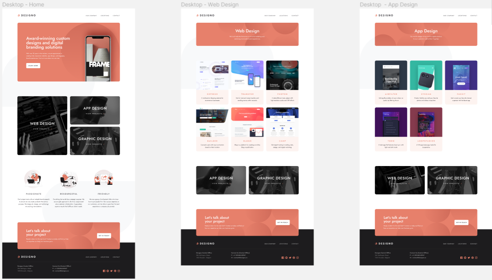
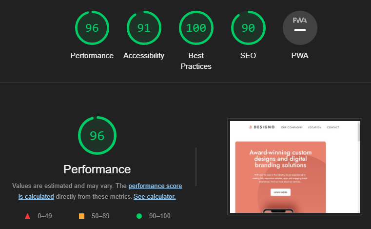

# Welcome to the Designo Project for Jepsen-6 BeCode Liège !

## This project is presented by [Kevin](https://github.com/Kiks4000) , [Latifa](https://github.com/LeclercqL) & [Nicolas](https://github.com/lambertnicolas)
### You can see the progress of the project on our Trello Page : [Trello](https://trello.com/b/iqueOCi7/designo)

#### The design given be BeCode:

#### If You want to take a look at the entire design :  [Figma](https://www.figma.com/file/l95gv4piXhWCegSRZIXe3y/designo-becode?node-id=0%3A1)

#### Our LightHouse Report ! : 

#### Technology used for this project :

> HTML
> CSS
> SASS
> JS

#### To see the final result on GitHub Page : [GitHub Page]()
